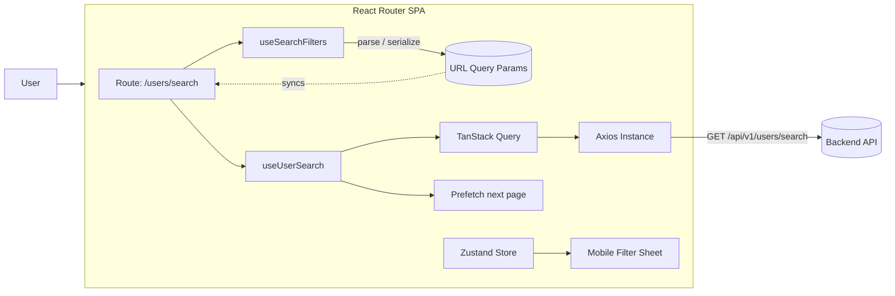
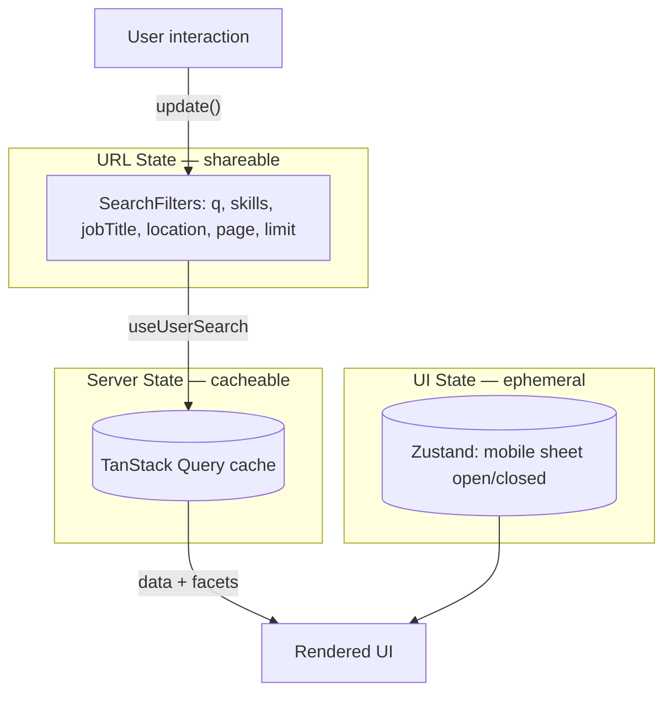
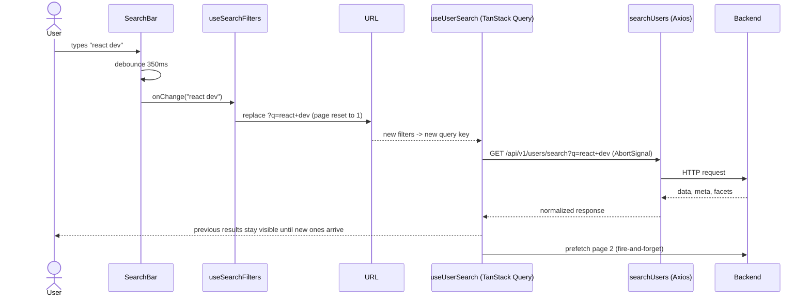

# LinkedIn Profile Search

---

## 🚀 Getting Started

### Prerequisites

| Tool    | Version |
| ------- | ------- |
| Node.js | ≥ 20    |
| npm     | ≥ 10    |

### 1. Install dependencies

```bash
npm install
```

### 2. Configure the environment

Create a `.env` file in the project root (or copy the provided example):

```bash
cp .env.example .env
```

```dotenv
VITE_API_URL=http://localhost:4000
```

> Make sure the backend serving `GET /api/v1/users/search` is running on that URL.

### 3. Start the dev server

```bash
npm run dev
```

Open [http://localhost:5173](http://localhost:5173) — you'll be redirected to `/users/search`.

### 4. Other scripts

```bash
npm run typecheck   # Type generation + TypeScript check
npm run test        # Run all tests (Vitest)
npm run build       # Production build (SPA mode → build/client)
```

---

## 🏗 Architecture

### High-level overview



### State management strategy

The key architectural decision: **the URL is the single source of truth for search state**.



| State type     | Owner                        | Why                                                    |
| -------------- | ---------------------------- | ------------------------------------------------------ |
| Search filters | **URL** (`useSearchFilters`) | Shareable links, back/forward navigation, refresh-safe |
| Server data    | **TanStack Query**           | Caching, deduplication, cancellation, prefetching      |
| UI state       | **Zustand**                  | Tiny ephemeral state (mobile sheet), no prop drilling  |

---

## 🔍 Search & Filters

### How a search flows end-to-end



### Filters

| Filter     | Type          | Control                  | URL param  | Behavior                                              |
| ---------- | ------------- | ------------------------ | ---------- | ----------------------------------------------------- |
| Keyword    | free text     | Search input (debounced) | `q`        | Replaces history entry, resets page                   |
| Skills     | multi-select  | Popover + checkboxes     | `skills`   | Comma-joined (`skills=React,TypeScript`), resets page |
| Job title  | single-select | Select dropdown          | `jobTitle` | Resets page                                           |
| Location   | single-select | Select dropdown          | `location` | Resets page                                           |
| Page size  | fixed set     | —                        | `limit`    | 20 / 40 / 60                                          |
| Pagination | number        | Page buttons             | `page`     | **Pushes** a history entry so the Back button works   |

Key behaviors:

- **Facets drive the filters.** The API response includes `facets` (available skills / job titles / locations with counts). Filter controls render disabled until facets arrive.
- **History semantics.** Typing or changing filters _replaces_ the current history entry (no history spam); pagination _pushes_ entries so the browser Back button feels natural.
- **Clean URLs.** Default values are omitted (`/users/search`, not `/users/search?q=&page=1`).
- **Stale request cancellation.** Every search passes TanStack Query's `AbortSignal` into Axios, so outdated requests are cancelled automatically.

### Example API call

```text
GET /api/v1/users/search?q=react&skills=TypeScript,Node.js&jobTitle=Frontend Developer&location=Berlin&page=2&limit=20
```

Response shape:

```json
{
  "data": [{ "id": "...", "fullName": "...", "skills": [] }],
  "meta": { "page": 2, "limit": 20, "total": 143, "totalPages": 8 },
  "facets": {
    "skills": [{ "value": "React", "count": 87 }],
    "jobTitles": [{ "value": "Frontend Developer", "count": 42 }],
    "locations": [{ "value": "Berlin", "count": 31 }]
  }
}
```

---

## 🛠 Tech Stack & Why

| Tool                                          | Purpose in this project                                                             |
| --------------------------------------------- | ----------------------------------------------------------------------------------- |
| **React Router v7** (framework mode)          | Routing, typed `Route` params/meta, SPA mode                                        |
| **TanStack Query**                            | Server-state cache, `keepPreviousData`, request cancellation, next-page prefetch    |
| **Zustand**                                   | Minimal global store for ephemeral UI state (mobile filter sheet visibility)        |
| **Axios**                                     | HTTP client with a centralized instance, timeout & error normalization (`ApiError`) |
| **Tailwind CSS 4**                            | Utility-first styling with a shadcn-style oklch design-token theme                  |
| **Base UI** (`@base-ui/react`)                | Headless, accessible primitives for popover, select, dialog, checkbox               |
| **class-variance-authority + tailwind-merge** | Variant-driven component styling (shadcn/ui pattern)                                |
| **lucide-react**                              | Icon set                                                                            |
| **Vitest + Testing Library**                  | Unit & component testing in jsdom                                                   |
| **TypeScript**                                | End-to-end type safety, including generated route types                             |

---

## 🧪 Testing

```bash
npm run test
```

- `search-params.test.ts` — URL parsing/serialization edge cases (invalid pages, missing params, comma-joined skills…)
- `search-users.test.ts` — API layer: query building, error normalization
- `active-filters.test.tsx` — chip rendering, removal, clear-all behavior

> ℹ️ Tests run against a dedicated `vitest.config.ts` (without the React Router Vite plugin, whose JSX preamble is incompatible with Vitest).

---

## 📦 Build & Deploy

The app runs in **SPA mode** (`ssr: false`) — the build outputs a static bundle:

```bash
npm run build   # → build/client
```

Serve `build/client` from any static host and point API calls at your backend via `VITE_API_URL`.
